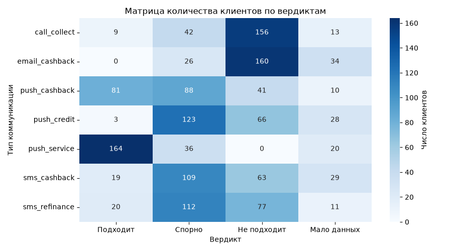
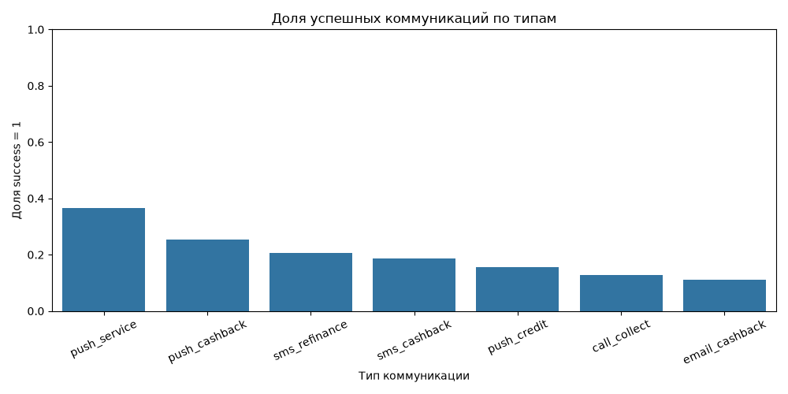

# NOTES

## 1. Соответствие реализации формуле

Реализация соответствует формуле описанной в `materials/scoring.md`.

Одним из отступлений является параметризация формулы, вместо захардкоженных значений
весовых коэффициентов и минимального количества собственных коммуникаций предлагается задавать их в качестве параметров.
Стандартные значения при этом сохранены такими же как предлагается в предложенной спецификации.

Значения можно изменить как через `.env` файла, так и через пользовательский интерфейс.

В связи с этим, а также различными парадигмами чистого кода и объектно-ориентированного проектирования вычисление 
предсказания происходит не просто в виде функции, а через отдельный сервис с одним публичным методом декларирующим следующий интерфейс:

```python
    def score(
        self,
        profile: Client,
        comm_type: CommType,
        comm_history: pd.DataFrame,
        clients_db: pd.DataFrame,
        comm_db: pd.DataFrame,
        runtime_settings: Settings | None = None,
        **kwargs
    ) -> Prediction:
```

Реализация мат. модели в рамках отдельного сервиса позволяет выделить абстрактный класс, который задаст единый интерфейс для всех 
возможных реализаций. Что полезно при тестировании различных способов предсказаний целевой характеристики.

Фрагмент реализации самой формулы:
```python
    def _calc_score(
        self,
        n_own: int,
        p_own: float,
        n_sim: int,
        p_sim: float,
        fatigue_coefficient: float,
        own_history_min_count: int = 3,
        sim_coef: float = 0.7,
        own_coef: float = 0.3,
    ) -> float:
        """
        Вычисляет итоговый скор по следующему правилу:
        - При `n_own >= own_history_min_count`:
            `P_raw = sim_coef * p_sim + own_coef * p_own`
        - При `n_own < own_history_min_count`:
            `P_raw = p_sim`
        - `P = P_raw * fatigue_coefficient`.

        Стандартные значения: `own_history_min_count=3`, `sim_coef=0.7`, `own_coef=0.3`.
        Приоритет оценки при стандартных (0.7, 0.3) отдается похожим клиентам.
        """
        if n_own >= own_history_min_count:
            score = sim_coef * p_sim + own_coef * p_own
        else:  # elif n_own < 3:
            score = p_sim
        return score * fatigue_coefficient
```

## 2. Результаты демо для всех типов коммуникаций (`push_cashback` включительно)

|    | comm_type      |   Подходит |   Спорно |   Не подходит |   Мало данных |
|---:|:---------------|-----------:|---------:|--------------:|--------------:|
|  0 | call_collect   |          9 |       42 |           156 |            13 |
|  1 | email_cashback |          0 |       26 |           160 |            34 |
|  2 | push_cashback  |         81 |       88 |            41 |            10 |
|  3 | push_credit    |          3 |      123 |            66 |            28 |
|  4 | push_service   |        164 |       36 |             0 |            20 |
|  5 | sms_cashback   |         19 |      109 |            63 |            29 |
|  6 | sms_refinance  |         20 |      112 |            77 |            11 |

Удобно анализировать данные в форме тепловой карты:



Взглянув на результаты можно сделать следующие выводы:
- Клиенты не любят звонки коллекторов и не пользуются электронной почтой
- Хуже относятся к кредитным предложениям
- Обращают внимание на сервисные уведомления и часто реагируют на пуш-уведомления с кешбеком
- Форма взаимодействия: push-уведомления предпочтительнее чем sms.

## 3. Проверка ручного режима на клиенте `30011`

Настройки при проверке **стандартные**, по спецификации.

> *Поля клиента такие: PIN 30011, возраст 29, город Москва. Зарплатный флаг оставьте пустым — в формуле это не Y, человек идёт как не зарплатник. Сотрудник и банкрот оба N, текущая просрочка Y, в продуктах debit;salary.*

Клиент: `30011`
Ключевые признаки:
- Возраст: 29 лет (`age_bin = 25-34`)
- Зарплатный флаг: N (`salary_bin = N`)
- Флаг просрочки: Y (`delinq_bin = Y`)

По данным **трём признакам** определяется схожесть пользователя с другими пользователями.

Тип коммуникации: `sms_refinance`

- **P:** 34.4%
- **verdict:** Подходит
- **Краткое замечание по результату:** 
  коэффициент усталости клиента = 1 по-скольку единственное взаимодействие этого типа в указанное временное окно было выполнено удачно один раз. 
  При этом число взаимодействий за всё время у клиента = 5, поэтому в итоговом расчете используются обе оценки доли успешности взаимодействий.
  Т.е. (32.0 * 0.7 + 40.0 * 0.3) * 1.0 = 34.4%, что в точности значение указанное на странице системы. 

> Этот пример используется только для проверки ручного режима и не является моим основным кейсом.

## 4. Мой клиент

Настройки при проверке **стандартные**, по спецификации.

Клиент: `30010`
Ключевые признаки:
- 23 года (`age_bin = 18-24`)
- Запрплатная карта (`salary_bin = Y`)
- Нет задолженностей (`delinq_bin = N`)

По данным **трём признакам** определяется схожесть пользователя с другими пользователями.

Почему выбран именно этот клиент:
> Переключившись на данного клиента я заметил дисбаланс в данных при варьировани данных возраста и флагов. 
> Например, если проверить данного пользователя с признаками (`age_bin = 18-24`, `salary_bin = N`, `delinq_bin = Y`) *(остались от клиента `30011`)*, т.е. молодой должник, то 
> данных по подобным клиентам мало. А если установить (`age_bin = 25-34`, `salary_bin = N`, `delinq_bin = Y`), то таких клиентов больше.
> Можно сделать вывод что среди молодых - должников меньше, например =)
> Вообще выбор клиента _практически неважен_ и определяет лишь какие коммуникации будут отброшены из справочника и какая будет усталость. 
> Основу мат. модели составляют те 3 признака по которым определяется схожесть клиентов.

### Рассмотрим тип "Пуш - Кешбек".

Полученный расчет выглядит следующим образом:

- Похожие клиенты: 
  - p_sim = 19.5%
  - n_sim = 82
- Личная история:
  - p_own = 0.0%
  - n_own = 5
- Итог:
  - fatigue = 0.7
  - P = 9.6%
  - Вердикт = Не подходит

**Объяснение:**
1. У данного пользователя в истории имеется лишь 5 взаимодействий с типом `push_cashback` -> `n_own = 5`
2. Коэффициент усталости используется негативный (0.7) поскольку всего одно успешное взаимодействие из 5 произошло в рассматриваемом временном окне (`h-04390` `2026.09.05`)
3. Тогда по формуле получаем 0.7 * (19.5% * 0.7 + 0.0% * 0.3) ~= 9.555% ~= 9.6% (в системе конечно считается с полной точностью, округление происходит только при выводе)

### Рассмотрим тип "Пуш - Сервис".

Согласно проведенному ранее анализу данных было видно, что сервисные пуши как правило подходят пользователям. 
Посмотрим так ли это для моего клиента.

Полученный расчет выглядит следующим образом:

- Похожие клиенты: 
  - p_sim = 45.7%
  - n_sim = 92
- Личная история:
  - p_own = 45.7%
  - n_own = 0
- Итог:
  - fatigue = 1.0
  - P = 45.7%
  - Вердикт = Подходит

**Объяснение:**
1. Можем наблюдать *edge-кейс*, в рамках которого у пользователя отсутствует история взаимодействия по данному типу. В следствии чего `p_own=p_sim`
2. И второе граничное условие которое выполняем при рассмотрении этого клиента - в формуле учитываются только похожие клиенты когда n_own <3. 
3. Тогда вычислений не требуется и ответом являются данные по похожим клиентам - 45.7%.

### Блок схема

```mermaid
flowchart TD
    A[Клиент + тип коммуникации] --> B[Определить bins клиента]
    B --> C[Найти похожих клиентов]
    C --> D[Исключить самого клиента]

    D --> E[Взять коммуникации похожих<br/>только нужного типа]
    E --> F[Посчитать n_sim и p_sim]

    A --> G[Взять личную историю<br/>только нужного типа]
    G --> H[Посчитать n_own и p_own]

    H --> I{n_own = 0?}
    I -- Да --> I1[p_own = p_sim]
    I -- Нет --> J[""]
    I1 --> J

    G --> K[Проверить свежие коммуникации]
    K --> L{Есть неуспешные<br/>в fatigue-окне?}
    L -- Да --> L1[fatigue = 0.7]
    L -- Нет --> L2[fatigue = 1.0]

    F --> M{n_own >= 3?}
    J --> M

    M -- Да --> N[P_raw = 0.7 * p_sim<br/>+ 0.3 * p_own]
    M -- Нет --> O[P_raw = p_sim]

    N --> P[P = P_raw * fatigue]
    O --> P

    L1 --> P
    L2 --> P

    P --> Q[Сформировать Prediction]
```

## 5. Где формула спорит со здравым смыслом

У меня есть гипотеза связанная с признаком "есть задолженность", а именно два момента:
1. Клиентам не входящим в категорию должников (`delinq_bin=N`) логично было бы коммуникации по задолженности не советовать. 
2. Клиентам входящим же в данную категорию звонки должны рекоммендоваться вне зависимости от их отклика. (очевидно что такие звонки нежелательны 
и большинство будет так или иначе их избегать и игнорировать)

При этом имеющаяся мат. модель в целом неплохо коррелирует с моей логикой в частности по первому пункту, но я обнаружил и набор признаков под которые
вердикт модели "Не подходит".

Так если у клиента следующие признаки (абстрактный, без истории. Т.е. по сути анализируем средних клиентов):
- age_bin=18-24
- salary_bin=Y
- delinq_bin=Y
То модель предсказывает вердикт что коммуникация типа `call_collect` не подходит. (P=8.3%)

В имеющемся справочнике есть такие клиенты, например `client_pin=30150`.
Для него расшифровка отсчета выглядит следующим образом:

- Похожие клиенты: 
  - p_sim = 10.0%
  - n_sim = 10
- Личная история:
  - p_own = 0%
  - n_own = 0
- Итог:
  - fatigue = 1.0
  - P = 10.0%
  - Вердикт = Не подходит

Замечу также что здесь и выборка маленькая, возможно эта гипотеза сойдет на нет при её расширении. 
Поскольку в других `age_bin` с сохранением других признаков модель больше склоняется в другую сторону весов.

## 6. Что я бы изменил

На мой взгляд в текущей постановке можно пересмотреть использование весов и порога. 
Т.е. не фиксировать веса `0.7` и `0.3` и использовать их как константы, а рассчитывать их динамически, например на основе числа
коммуникаций целевого пользователя. *(Данное значение в текущей постановке не используется в формуле вовсе)*

Например можно балансировать между влиянием схожих пользователей и клиента использовлв одну константу `w = n_own / (n_own + n_sim)`.
А в формуле использовать ее так: `P = (1 - w) * p_sim + w * p_own`. Тогда по мере увеличения базы знаний коммуникаций целевого пользователя, 
система будет лучше подстроена именно к нему.  А когда коммуникаций мало, решение будет приниматься с большим влиянием на схожих пользователей.

Другим направлением является использование моделей машинного обучения для предсказания вероятности успешной коммуникации. Но для этого
нужно существенно расширить набор признаков, заниматься feature engineering и т.д. и т.п. 

Также изменения нужны и при расчете коэффициента усталости пользователя. В текущей формулировке нет поправки на число коммуникаций.
Ведь отказ от коммуникации не всегда означает "усталость". Скорее подряд идущие и частые отказы. При текущем пороге в 1 неудачную коммуникацию
могут попасть пользователи которым просто уведомление пришло в неправильное время в неправильном месте.

## 7. Самый слабый `comm_type`

|    |   index | comm_type      |   communication_count |   success_count |   success_rate |
|---:|--------:|:---------------|----------------------:|----------------:|---------------:|
|  0 |       4 | push_service   |                   745 |             272 |       0.365101 |
|  1 |       2 | push_cashback  |                   842 |             214 |       0.254157 |
|  2 |       6 | sms_refinance  |                   589 |             122 |       0.207131 |
|  3 |       5 | sms_cashback   |                   698 |             130 |       0.186246 |
|  4 |       3 | push_credit    |                   469 |              73 |       0.15565  |
|  5 |       0 | call_collect   |                   588 |              75 |       0.127551 |
|  6 |       1 | email_cashback |                   464 |              51 |       0.109914 |




Данные были получены путем анализа таблицы `communications`.

А именно, `group_by` по типу коммуникации и далле подсчета:
- количества коммуникаций
- количества успешных коммуникаций
- среднее по количеству успешных коммуникаций

По данным видно, что наиболее слабым типом коммуникации является `email_cashback`. Что на самом деле логично, т.к.
многие пользователи, *по личному опыту* пользуются электронной почтой только для регистрации в системах.

## 8. Недавняя коммуникация при `fatigue = 1.0`

Необходимо выбрать того пользователя, для которого выполняется следующее:
- Коммуникация с которым была "последней" (ближайшая к текущему моменту)
- Все коммуникации по искомому типу были успешны за рассматриваемый период времени.

Среди таких пользователей несколько, но выберу одного:
- *PIN:* 30001
- *comm_type:* sms_refinance
- *last_comm_date:* 2026-09-01.
- *success:* 1

Для такого пользователя `fatigue=1.0` поскольку `sms_refinance` коммуникация была успешна.

Если посмотрим на таблицу то увидим что более ранние коммуникации были только типа `push_cashback` и все они были неуспешны.

`fatigue=1.0` может также сохраняться и в других случаях, например:
1. Если самая ранняя коммуникация находится вне рассматриваемого периода времени.
2. Из-за некорректности даты строки влияющие на `fatigue` могут быть пропущены.

## 9. Моё допущение

1. Пропуск ошибочных `comm_date` при вычислении `fatigue`. Поскольку при чтении файла некорректные даты преобразуются в тип `NaT` (Not a Time), они пропускаются при вычислении `fatigue`.
Однако эти строки все еще учитываются при вычислении `p_own`, `n_own`, поскольку при их нахождении дата не учитывается. (хоть таких данных в исходном файле и нет)
2. Не учтено время коммуникации (таймзона). Например из-за временных зон может изменится дата коммуникации. И тогда изменится попадет коммуникация в рассмотрение при вычислении `fatigue` 
или нет. 
3. Допустил необходимость параметризации формулы. Описано в пункте 1 записки.

## 10. Отклонённый вариант из `scoring.md`

Не переносил всё что в конце файла `scoring.md`:

> Отклоненный вариант расчёта
> Ниже — ранее предлагавшиеся коэффициенты. В текущей постановке они не действуют. В код переносятся только шаги 1–5: смесь 0.7 (похожие) и 0.3 (личная история) при трёх и более касаниях, fatigue 0.7, вердикт «подходит» от 0.30, пустой salary_flag интерпретируется как N, оцениваемый клиент в выборку похожих не входит.
> Реализация с весами 0.55/0.45, порогом 0.28, усталостью 0.4 либо с трактовкой пустого зарплатного флага как Y означает расхождение с действующей формулой.
> P_raw = 0.55 * p_own + 0.45 * p_sim при двух и более личных касаниях. Усталость 0.4. Порог «подходит» — 0.28. Значения salary_flag пусто, yes и 1 трактовать как зарплатника. Оцениваемый PIN из похожих не исключать. Для типа рефинансирования инвертировать success. Вариант снят с рассмотрения.
